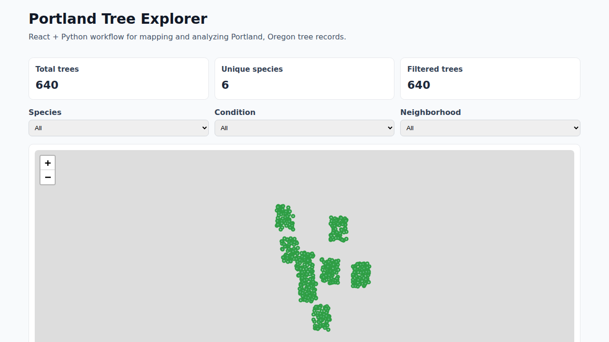
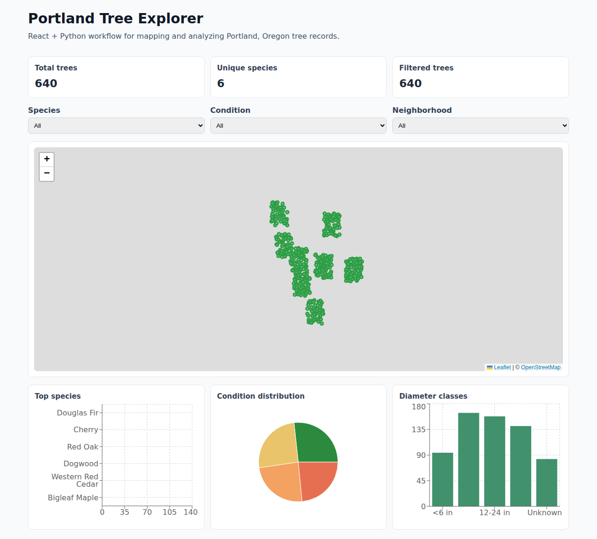

# portland-tree-data

Analysis and visualization (map + charts) of Portland, Oregon tree data with a **Python prep pipeline** and **React frontend**.

## Screenshots

Screens below use a local sample dataset distributed across Portland neighborhoods.

### App overview



### Full page



## Stack

- Python: fetch + normalize GeoJSON and compute summary metrics
- Node/React (Vite): interactive map, filters, and charts
- React Leaflet + Recharts for visualization

## Project layout

- `/scripts/prepare_tree_data.py` - data ingestion + transformation
- `/web` - React UI
- `/web/public/data/trees.geojson` - normalized tree points consumed by UI
- `/web/public/data/summary.json` - computed metrics consumed by UI
- `/DEVELOPMENT_LOG.md` - step-by-step build notes for interview discussion

## 1) Prepare data (Python)

From repository root:

```bash
python scripts/prepare_tree_data.py
```

Optional:

```bash
python scripts/prepare_tree_data.py --source /absolute/path/to/trees.geojson --limit 25000
```

The default source points to Portland's public tree endpoint. If network access is restricted in your environment, download a GeoJSON file separately and pass it with `--source`.

## 2) Run the React app

```bash
cd web
npm install
npm run dev
```

Then open the local Vite URL shown in terminal.

## 3) Production build

```bash
cd web
npm run build
```
